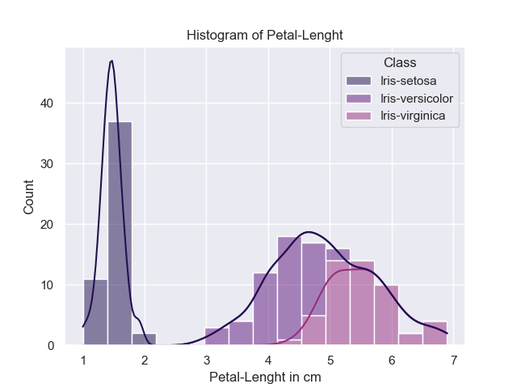

# Table of Contents
* [Itroduction](#introduction)
    * [Summary of the data set](#summary-of-the-data-set)
    * [Running the Code](#running-the-code)
    * [Packages and Options](#packages-and-options)
    * [Opening the Data](#opening-the-data)
    * [Output File](#output-file)
* [Summary Statistics and Data Visualisation](#introduction)
    * [Summary Statistics](#summary-statistics)
    * [Histograms](#histograms)
    * [Data as Arrays](#data-as-arrays)
    * [Scatter Plots](#[scatter-plots)
* [Additional Analysis](#additional-analysis)
    * [Summary Statistics by Group](#summary-statistics-by-group])
    * [Group by Class](#group-by-class)
    * [Statistical Tests](#statistical-tests)


# Summary of the data set

The iris data set is available from the UCI machine learning repository [1]. It is a frequently used database for demonstrating tools in data anaylsis [2]. The data set consists of 150 observations of iris plants.  Five attributes are recorded. Sepal lenght , sepal width, petal length, petal width,  are measured in centimeters. The class if also given which refers to the type of iris plant. There are three classes with 50 obervations of each, namely Iris Setosa, Iris Versicolour and Iris Virginica. The data set was famously used in a study meausring how these three classes of iris could best be differentiated based on their measurements [3]. 


[1] https://archive.ics.uci.edu/ml/datasets/iris<br> 
[2] https://www.sciencedirect.com/topics/mathematics/iris-data<br> 
[3] Fisher,R.A. "The use of multiple measurements in taxonomic problems" Annual Eugenics, 7, Part II, 179-188 (1936); also in "Contributions to Mathematical Statistics" (John Wiley, NY, 1950).<br> 

# Running the Code
It is important to have the dataset saved as "iris.data" and in the same directory as the python script[4]. Using a interative developpment enviroment such as Visual Studio code is recommended, to easily view the outputs and make changes to the script[5]. It is recommended to have Anaconda installed, as the code requires the installation of additional packages.
[4]https://python.land/creating-python-programs
[5]https://code.visualstudio.com/docs/python/python-tutorial

# Packages and Options
```python
import numpy as np
import pandas as pd
import matplotlib.pyplot as plt
import seaborn as sns
import scipy as stats
from scipy.stats import f_oneway


pd.set_option("precision", 2) # set pandas decimal precision
sns.set_theme(palette="magma") #set color seaborn plots
```

Numpy offers useful tools for working with arrays. I use numpy arrays as inputs for plotting
# Opening the Data


```python
datafile = "iris.data"
variableNames = ["Sepal-Lenght","Sepal-Width","Petal-Lenght","Petal-Width","Class"]
data = pd.read_csv(datafile,header = None, names = variableNames ) 
```

There are a number of ways to work with CSV files in python and I decided to use pandas as it makes simplifies the code and offers useful features [4].  With one line of code I could import the data and store it as a data frame. 


This is a familiar data structure, with the rows showing different observations and the columns their respective attributes. Pandas also offers many other useful features, for example manipulating or visualising data [5].


[4] https://realpython.com/python-csv/<br> 
[5] https://pandas.pydata.org/docs/user_guide/index.html#user-guide<br> 


# Output File
To save the output from the analysis I output my results to output.txt. I use a with statement to shorten the code and deal with error handling [6]. To creat the text file I use the function open() which takes the file name and the mode as its arguements. I open the file in write mode to create a new file when the program starts. To append the output of my results I write an append() function. This uses the file output.txt and opens it in append mode. 


[6] https://www.geeksforgeeks.org/with-statement-in-python/#:~:text=with%20statement%20in%20Python%20is,with%20statement%20makes%20code%20cleaner.<br> 
[7] https://realpython.com/working-with-files-in-python/<br> 

# Summary Statistics
To create summary statistics for the variables I used the describe() funtion from the pandas module . The describe funtion can be used to generate summary statistics for a variable, such as the mean, standard deviation and percentiles. To output the summary tables to the text file, I first convert the data to text and use the inbuilt write funtion to append the tables. This is a flexible method, which allows titles and text to be added to the tables [7]. I use the option pd.set_option("precision", 2) whichs limit the number of decimal places, making the tables easier to read. 

[6] https://pandas.pydata.org/docs/user_guide/basics.html#descriptive-statistics<br> 
[7] https://stackoverflow.com/questions/43423950/how-to-print-title-above-pandas-dataframe-to-csv<br> 
[8] https://pandas.pydata.org/pandas-docs/stable/user_guide/options.html#frequently-used-options<br> 


# Summary Statistics by Group
To get summary statistics for each class of iris plant I first need to group the data by class. This is dont with the pandas inbuilt function data.groupby() which takes a column name as its argument[20]. As I labeled the dataframe column with the class names "class" my function is data.groupby(["class"]). To get summary statistics by groups I apply the desc() and sum() functions to these groups. In the describe command I add the option desc(percentiles = []), since the output is easier to read without them [22] and percentiles.
  

 
[20]https://pandas.pydata.org/pandas-docs/stable/reference/api/pandas.DataFrame.groupby.html<br> 
[21] https://pandas.pydata.org/docs/user_guide/10min.html?highlight=group#grouping<br> 
[22] https://pandas.pydata.org/docs/reference/api/pandas.DataFrame.describe.html<br> 

# Histograms
To create historgrams of the variables I use the hist() funtion from matplotlib[9]. In addition to plotting the variables I also include optional paramaters for the bin sizes and colors. I also used sample histograms from matplotlibs documentation as a reference[10]. The bins option allowed me to specify how many intervals I wanted to seperate the data into. I 
use a historgrom using two indices, one for the variable name and title and another for the color. I use a zip() funtion, which is described in more detail in the scatter plots section.

|                                         |                                         |
|:---------------------------------------:|:---------------------------------------:|                             
 | |
 | |

[9] https://matplotlib.org/stable/api/_as_gen/matplotlib.pyplot.hist.html#matplotlib.pyplot.hist<br> 
[10]https://matplotlib.org/stable/gallery/statistics/hist.html#sphx-glr-gallery-statistics-hist-py<br> 
[11]https://stackoverflow.com/questions/18648626/for-loop-with-two-variables<br> 
[12]https://stackoverflow.com/questions/37734512/savefig-loop-adds-previous-plots-to-figure<br> 
[13]https://matplotlib.org/3.1.1/tutorials/colors/colors.html<br> 
https://seaborn.pydata.org/generated/seaborn.histplot.html?highlight=histplot#seaborn.histplot<br> 
https://seaborn.pydata.org/generated/seaborn.color_palette.html#seaborn.color_palette<br> 


# Data as Arrays
Storing the columns as arrays is useful in the case that the whole data frame is not needed. It is also necessary for some of the plotting functions in matplotlib, which do not allow for dataframe inputs. The dataFrame.to_numpy() function converts a dataframe object type to a numpy array. dataFrame is the name of the dataframe object, in my case data. In order to get an array for each column or variable I select columns from the data frame using dataFrame("column name") [14]


[14] https://pandas.pydata.org/docs/user_guide/10min.html<br> 
[15] https://pandas.pydata.org/docs/reference/api/pandas.DataFrame.to_numpy.html#pandas.DataFrame.to_numpy<br> 
[16] https://stackoverflow.com/questions/46122910/display-print-one-column-from-a-dataframe-of-series-in-pandas<br> 


# Scatter Plots
I created a scatter plot of the the variables using the scatter() function from matplotlib. I use the default paramaters (x,y) to plot 6 pairs of variables. Matplotlib handles the other parts of creating the graph, such as creating the figure and axis. The other funtions I use are plt.savefig(), and plt.close(). Plt.savefig() takes the filename as a paramater and plt.close() is necessary to create a new figure, so that the individual plots, plt.scatter(), are created seperately. To reduce the lines in the code I use a zip() function 
This allows for parallel iteration [19]. Note there are four variables in total, however the class variable is categorical so I omit it in the scatter plots. 
|                                         |                                         |
|:---------------------------------------:|:---------------------------------------:|                             
 | |
 | |
 | |

[17]https://matplotlib.org/stable/api/_as_gen/matplotlib.pyplot.scatter.html<br> 
[18]https://www.w3schools.com/python/python_for_loops.asp<br> 
[19]1https://realpython.com/python-zip-function/#:~:text=Python's%20zip()%20function%20is,%2C%20sets%2C%20and%20so%20on.<br> 


# Additional Analysis
As one of the original uses for this data set was to see which variables could best be used to differentiate classes of the iris plant, I would like to see how the variables, such as sepal lenght and width, vary across the different classes. Some useful approaches include looking at summary statitics, by group, test statistics and graphical representations. 


# Group by Class
For the statistical test I need to be able to seperate the data by class. Using the function loc[] I can specify the data to select based on a column and condition. loc[] takes label values, for example a row or column name, and boolean arrays. I use these features to select the groups which are the same class. Seperating the data helps in future testing as it makes it easier to refer a particular data. 

[26] https://stackoverflow.com/questions/17071871/how-to-select-rows-from-a-dataframe-based-on-column-values<br> 
[27] https://pandas.pydata.org/docs/reference/api/pandas.DataFrame.loc.html<br> 

# Statistical Tests
I am interested seeing how the variables, such as sepal lenght, vary across the different classes. It is therefore worth testing  whether the variation between classes observed in the summary statistics is due to chance or whether it is due to differences across the classes. To test this I use one-way ANOVA, which is used to test whether there are any statistically significant differences between the means of two or more groups [25]. The groups are the different classes, setosa, versicolor and virginica and there are four means: sepal lenght, sepal width, petal lenght and petal width . The F-Test is used with the the null hypthoses that the means, such as speal lenght, are equal across the groups (&mu;<sub>setosa;</sub> = &mu;<sub>versicolor;</sub> = &mu;<sub>virginica;</sub>.  

I import scipy, which includes many different functions for statisitical testing [24]. I use the scipy function f_oneway() for one-way ANOVA[27]. The first test looks at whether the variation in petal lenghts across the groups is statistically significant. f_oneway() takes the petal lenghts of each groups, which are arrays, as its inputs (setosa;<sub>petal lenght;</sub>versicolor;<sub>petal lenght;</sub>virginica;<sub>petal lenght;</sub>). It computes an F statistic (F= variation between groups / variation within groups) and reports this along with the p value, the probability of observing the test statistic. I complete the same test for the other measurments, petal width, sepal lenght, and sepal width.

My result allow me to reject the null hpyothesis that the measurements are the same for the different classes of Iris. Taking the petal width test as an example, the F statistic is 1179, and the chances of observing this result if there are no differences in measurmenets across the classes is 3.05*e^-91. The full results can be found in the output.txt. 


[24] https://docs.scipy.org/doc/scipy/reference/tutorial/stats.html<br> 
[25] https://www.statisticshowto.com/probability-and-statistics/hypothesis-testing/anova/<br> 
[26] https://medium.com/@rrfd/f-tests-and-anovas-examples-with-the-iris-dataset-fe7caa3e21d0<br> 
[27] https://docs.scipy.org/doc/scipy/reference/generated/scipy.stats.f_oneway.html#scipy.stats.f_oneway<br> 
[28] https://www.w3schools.com/python/scipy_statistical_significance_tests.asp<br> 


# additional references


https://docs.scipy.org/doc/scipy/reference/tutorial/stats.html overview of statistical methods in python. 
https://www.kite.com/python/docs/builtins.repr convert value to string
https://stackoverflow.com/questions/11256433/how-to-show-math-equations-in-general-githubs-markdownnot-githubs-blog writing to github
https://github.com/adam-p/markdown-here/wiki/Markdown-Cheatsheet