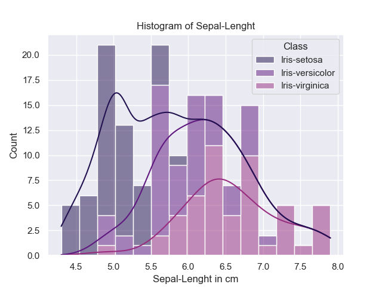
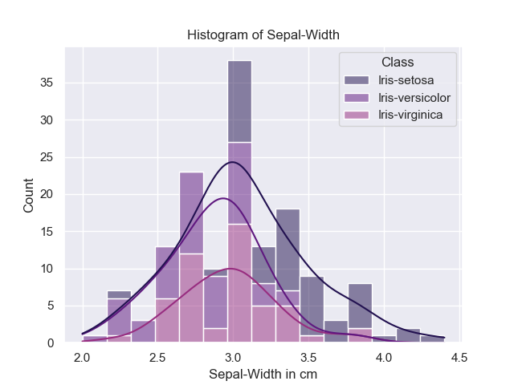
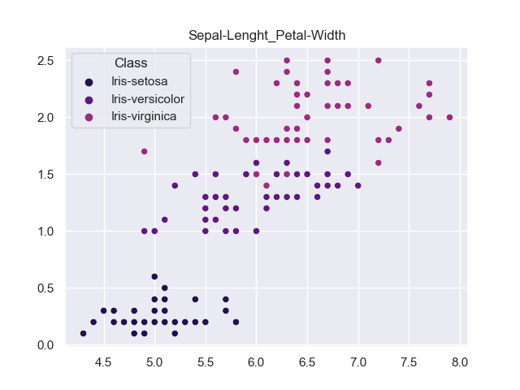
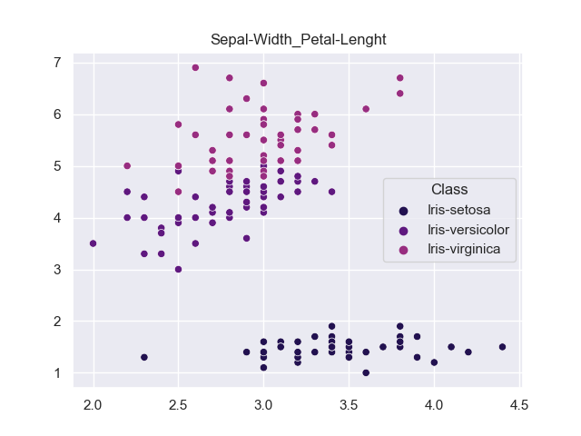

# Table of Contents

* [Introduction](#introduction)
    * [Summary of the data set](#summary-of-the-data-set)
    * [Running the Code](#running-the-code)
    * [Packages and Options](#packages-and-options)
    * [Opening the Data](#opening-the-data)
    * [Output](#output)
* [Summary Statistics and Data Visualisation](#introduction)
    * [Summary Statistics](#summary-statistics)
    * [Histograms](#histograms)
    * [Data as Arrays](#data-as-arrays)
    * [Scatter Plots](#[scatter-plots)
* [Additional Analysis](#additional-analysis)
    * [Summary Statistics by Group](#summary-statistics-by-group])
    * [Group by Class](#group-by-class)
    * [Statistical Tests](#statistical-tests)
* [Conclusion](#conclusion)
* [References](#references)


# Summary of the data set

The iris data set is available from the UCI machine learning repository [1]. It is a frequently used database for demonstrating tools in data analysis [2]. The data set consists of 150 observations of iris plants. Five attributes are recorded. Sepal length, sepal width, petal length, petal width, are measured in centimetres. The class if also given which refers to the type of iris plant. There are three classes with 50 observations of each, namely Iris Setosa, Iris Versicolour and Iris Virginica. The data set was famously used in a study measuring how these three classes of iris could best be differentiated based on their measurements [3].


# Running the Code
It is important to have the dataset saved as "iris.data" and in the same directory as the python script [4]. Using a interative developpment enviroment such as Visual Studio code is recommended, to easily view the outputs and make changes to the script [5]. It is also recommended to have Anaconda installed, as the code requires the installation of additional packages.


# Packages and Options
```python
import numpy as np
import pandas as pd
import matplotlib.pyplot as plt
import seaborn as sns
import scipy as stats
from scipy.stats import f_oneway


pd.set_option("precision", 2) # set pandas decimal precision
sns.set_theme(palette="magma") #set color seaborn plots
```

I import the above packages which contain additional functions. Numpy offers useful tools for working with arrays. I use numpy arrays as inputs for the plotting functions. Pandas is a tool for data analysis and manipulation. I use pandas' functions to import the data and convert it into a data frame, and for summary statistics. Matplotlib.pyplot includes many different functions for plotting. It offers extensive tools for creating and customising plots. Seaborn offers additional plotting tools and is based on Matplotlib. Finally, I use scipy for its statistical testing functions and the f_oneway function is used for one-way ANOVA testing. 

For the pandas module I use "set_option("precision", 2)" which limits decimal outputs to two decimal places. For seaborn, I use the "set_theme(palette="magma")", which defines the color scheme of plots. 


# Opening the Data


```python
datafile = "iris.data"
variableNames = ["Sepal-Lenght","Sepal-Width","Petal-Lenght","Petal-Width","Class"]
data = pd.read_csv(datafile,header = None, names = variableNames ) 
```

There are several ways to work with CSV files in python and I decided to use pandas as it makes simplifies the code and offers useful features [8]. The main line of code specifies "data" as a pandas data frame "pd.read_csv(datafile,header = None, names = variableNames)". I specify "header = None", to indicate that there are no rows for column names, and "names = variableNames", to create column names. The data frame format is comparable to an excel table, and dividing the data by rows and columns makes it easy to refer to in later functions[9]. For example, when I group the variables by their class, or use imported functions. Matplotlib and Seaborn allow you to reference a dataframe in many of their functions.


# Output

```python

filename = "output.txt"
with open("output.txt", "w") as f:  # want a new file - open in write mode/
    f.write("iris.data Analysis \n \n")


def appendTable(input,title):
    with open("output.txt", "a") as f: # append mode
        output = input.to_string()
        f.write(title + "\n")
        f.write(output)
        f.write("\n \n")
        

def appendText(input):
          with open("output.txt", "a") as f:
              f.write("\n")
              f.write(input) 
              f.write("\n")
```

To save the output from the analysis I output my results to "output.txt". I use a with statement to shorten the code and deal with error handling [10]. "Open("output.txt", "w)" takes the file name as its first arguement and the file is opened initially in write mode to create a new file when the code is run.  I create two functions, one for appending text the other for tables. "open("output.txt", "a")" opens the file in append mode. "to_string()" takes the tables produced by pandas and converts them to text.


# Summary Statistics

| Sepal-Lenght |        | Sepal-Width |        | Petal-Lenght |        | Petal-Width |        | Class  |                 |
|--------------|--------|-------------|--------|--------------|--------|-------------|--------|--------|-----------------|
| count        | 150.00 | count       | 150.00 | count        | 150.00 | count       | 150.00 | count  | 150             |
| mean         | 5.84   | mean        | 3.05   | mean         | 3.76   | mean        | 1.20   | unique | 3               |
| std          | 0.83   | std         | 0.43   | std          | 1.76   | std         | 0.76   | top    | Iris-versicolor |
| min          | 4.30   | min         | 2.00   | min          | 1.00   | min         | 0.10   | freq   | 50              |
| 25%          | 5.10   | 25%         | 2.80   | 25%          | 1.60   | 25%         | 0.30   |        |                 |
| 50%          | 5.80   | 50%         | 3.00   | 50%          | 4.35   | 50%         | 1.30   |        |                 |
| 75%          | 6.40   | 75%         | 3.30   | 75%          | 5.10   | 75%         | 1.80   |        |                 |
| max          | 7.90   | max         | 4.40   | max          | 6.90   | max         | 2.50   |        |                 |


```python
for i in variableNames:
    summaryTable = data[i].describe()
    appendTable(summaryTable,i)

```

To create summary statistics for the variables I use two features from the pandas module. The first lets me refer to a particular variable (column) in the data, "data[i]". "describe()"
takes this input and creates summary statistics, such as the mean, standard deviation and count. To output the summary tables to the text file, I first convert the data to text and use the inbuilt write funtion to append the tables. This is a flexible method, which allows titles and text to be added to the tables [13]. The summary statistics allow us to get a better understanding of the data. We can easily see what the averages are for the different variables and the variation between observations.


# Histograms


```python
for i in ["Sepal-Lenght","Sepal-Width","Petal-Lenght","Petal-Width"]:

    sns.histplot(data=data, x=i, hue="Class", multiple="stack",bins=15,kde=True) # remove class for kde 
    sns.light_palette("seagreen", as_cmap=True)
    plt.xlabel(i+" in cm")
    plt.title("Histogram of " + i)
    plt.savefig(i + ".png")
    plt.close()
```


To create historgrams of the variables I use the "histplot()" from seaborn. Initially I used Matplotlib, however I chose Seaborn for the additional features. The first two paramaters of the histplot function are the data and the variables (columns) to be plotted. The option "multiple="stack"" means that multiple observations are stacked on top of each other, which allows all the information to be in the same place, with the downside of it being slightly less clear. bins=15 sets the numbers of intervals to divide the observations. The additional features offered here by Seaborn are the options hue and kde. Setting "hue="Class"" results in a different bar colour for each class of iris. This allows for useful comparisons between the classes. For example, from the plots below we notice that iris-setosa has the smallest petal lenght and width measurments while iris-verginica has the largest. Setting "kde=True" allows us to see an estimate of the full distibution, as we only observe a sample which is subject to sample variation, this setting gives us a better idea of the underlying population.  The matplotlib functions handle the other parts of creating the plot, such as labelling the axes "plt.xlabel()", adding a title "plt.title()", saving the figure "plt.savefig()", and closing it before starting a new one "plt.close()".

The histograms offer a lot more information than the summary statistics. By visualising the data we can see what the distributions look like. The hue="Class" option is especially useful for providing insights as we can see the different distributions for each class of iris plant. For example, we can see that iris-setosa plants have small petal measurements but are average when it comes to sepal measurements.


|                                         |                                         |
|:---------------------------------------:|:---------------------------------------:|                             
 | |
 | |

 
 


# Data as Arrays
```python
sepalLenght = data["Sepal-Lenght"].to_numpy()
sepalWidth = data["Sepal-Width"].to_numpy()
petalLenght = data["Petal-Lenght"].to_numpy()
petalWidth = data["Petal-Width"].to_numpy()
```

Storing the columns as arrays is useful in the case that the whole data frame is not needed. It is also necessary for some of the plotting functions in matplotlib, which do not allow for dataframe inputs. The "dataFrame.to_numpy()" function converts a dataframe object type to a numpy array. dataFrame is the name of the dataframe object, in my case data. In order to get an array for each column or variable I select columns from the data frame using "dataFrame("column name")" [21].


# Scatter Plots


```python
xVariables = [sepalLenght,sepalLenght,sepalLenght,sepalWidth,sepalWidth,petalLenght]
yVariables = [sepalWidth,petalLenght,petalWidth,petalWidth,petalLenght,petalWidth]
Titles = ["Sepal-Lenght_Sepal-Width","Sepal-Lenght_Petal-Lenght","Sepal-Lenght_Petal-Width",\
"Sepal-Width_Petal-Width","Sepal-Width_Petal-Lenght","Petal-Lenght_Petal-Width"]


for i, j, k in zip(xVariables,yVariables,Titles):
    #plt.scatter(i,j)
    sns.scatterplot(data=data, x=i, y=j,hue="Class")
    plt.title(k)
    plt.savefig(k)
    plt.close()
    
```

I first setup the variables to pass into my loop for creating scatter plots. The xVariables and yVariables are the numpy arrays that I created. This setup ensures that I get a scatter for each pair variables, exluding the categorical class variable, which should be omitted in scatter plots. The loop makes use of "zip()", which allows multiple variables to be iterated in the loop. Note that "i" and "j" correspond to the column title "k". I created a scatter plot of the the variables using the "scatterplot()" funtion from Seaborn. "Scatterplot()" takes two array inputs, for x and y. The rest of the funtions required to create and save the figure are handled by matplotlib, which are detailed in [histograms](#histograms).

The scatter plots also tell us a lot about the data, especially after introducing the hue option. This allows us to see the correlations for the different variables within each class. For example we can see a positive correlation between petal lenght and petal width for iris-virginica and iris-versicolor, but the relationship is less apparent in iris setosa. We can also see many different inisghts, such as that the relationship between sepal width and petal width is weak. 


|                                         |                                         |
|:---------------------------------------:|:---------------------------------------:|                             
 | |
 | |
 | |


# Additional Analysis
As one of the original uses for this data set was to see which variables could best be used to differentiate classes of the iris plant, I would like to see how the variables, such as sepal lenght and width, vary across the different classes. While the plots contain lots of useful information in this regard, I would also like to look at these differences through summary statistics and statistical tests.


# Summary Statistics by Group

```python
groupMeans = data.groupby(["Class"]).mean()
appendTable(groupMeans,"\n Group Means")
groupDesc = data.groupby(["Class"]).describe()
appendTable(groupDesc,"\n Descriptive Statistics by Class")
```


To get summary statistics for each class of iris plant I first need to group the data by class. This is done with the pandas inbuilt function "data.groupby()" which takes a column name as its argument[26]. As I labeled the dataframe column with the class names "Class" my function is "data.groupby(["Class"])". "Mean()" takes this array, grouped by class, and computes the mean of each variable for each group.


| Group Means     |              |             |              |             |
|-----------------|--------------|-------------|--------------|-------------|
|                 | Sepal-Lenght | Sepal-Width | Petal-Lenght | Petal-Width |
| Class           |              |             |              |             |
| Iris-setosa     | 5.01         | 3.42        | 1.46         | 0.24        |
| Iris-versicolor | 5.94         | 2.77        | 4.26         | 1.33        |
| Iris-virginica  | 6.59         | 2.97        | 5.55         | 2.03        |


"describe()" takes the same input and produces descriptive statistics, in addition to the mean we can see other statistics such as the count and standard deviation. Note that I do not display the full output, which includes the descriptive statistics for the other variables. This information is available in the output.txt. 


| Sepal Lenghts  | count | mean | std  | min | 25%  | 50% | 75% | max |
|----------------|-------|------|------|-----|------|-----|-----|-----|
| Iris-setosa    | 50.0  | 5.01 | 0.35 | 4.3 | 4.80 | 5.0 | 5.2 | 5.8 |
| Iris-versicolo | 50.0  | 5.94 | 0.52 | 4.9 | 5.60 | 5.9 | 6.3 | 7.0 |
| Iris-virginica | 50.0  | 6.59 | 0.64 | 4.9 | 6.23 | 6.5 | 6.9 | 7.9 |
|                |       |      |      |     |      |     |     |     |

The summary statistics are an alternative method to showing how these measurements vary across the different types of iris. Looking at the group means, we can see the difference in the average measurements is typically within one or two centimetres. 


# Group by Class
```python
irisSetosa = data.loc[data["Class"] == "Iris-setosa"]
IrisVersicolor = data.loc[data["Class"] == "Iris-versicolor"]
IrisVirginica = data.loc[data["Class"] == "Iris-virginica"]
```


For the statistical tests I seperate the data by class. Using pandas' "loc[]" function I can specify the data to select based on a column and condition. loc[] takes label values, for example a row or column name, and boolean arrays. I use these features to select the groups which are the same class. Seperating the data helps in future testing as it makes it easier to refer to the correct data. 


# Statistical Tests

```python
a = irisSetosa["Petal-Lenght"].to_numpy()
b = IrisVersicolor["Petal-Lenght"].to_numpy()
c = IrisVirginica["Petal-Lenght"].to_numpy()

petalLenghtTest = f_oneway(a,b,c)
appendText("Petal-Lenght F-Test")
appendText(repr(petalLenghtTest))
```

I am interested seeing how the variables, such as sepal lenght, vary across the different classes. It is therefore worth testing whether the variation between classes observed in the summary statistics is due to chance (we only have samples of the populations) or whether it is due to differences across the classes. To test this I use one-way ANOVA, which is used to test whether there are any statistically significant differences between the means of two or more groups [31]. The groups are the different classes, setosa, versicolor and virginica and there are four means: sepal lenght, sepal width, petal lenght and petal width. The F-Test is used with the the null hypthoses that the means, such as speal lenght, are equal across the groups (&mu;<sub>setosa;</sub> = &mu;<sub>versicolor;</sub> = &mu;<sub>virginica;</sub>).  

I import scipy, which includes many different functions for statisitical testing [32]. I use the scipy function "f_oneway()" for one-way ANOVA [34]. The first test looks at whether the variation in petal lenghts across the groups is statistically significant. f_oneway() takes the petal lenghts of each groups, which are arrays, as its inputs (setosa;<sub>petal lenght;</sub>versicolor;<sub>petal lenght;</sub>virginica;<sub>petal lenght;</sub>). It computes an F statistic (F= variation between groups / variation within groups) and reports this along with the p value, the probability of observing the test statistic. I complete the same test for the other measurments, petal width, sepal lenght, and sepal width.


| ANOVA Test Results                                                          |
|-----------------------------------------------------------------------------|
| Petal-Lenght F-Test                                                         |
| F_onewayResult(statistic=1179.0343277002194, pvalue=3.0519758018278374e-91) |
| Petal-Width F-Test                                                          |
| F_onewayResult(statistic=959.3244057257613, pvalue=4.376956957488959e-85)   |
| Sepal-Lenght F-Test                                                         |
| F_onewayResult(statistic=119.26450218450468, pvalue=1.6696691907693826e-31) |
| Sepal-Width F-Test                                                          |
| F_onewayResult(statistic=47.36446140299382, pvalue=1.3279165184572242e-16)  |


My result allow me to reject the null hpyothesis that the measurements are the same for the different classes of Iris. Taking the petal width test as an example, the F statistic is 1179, and the probability of observing this result if there are no differences in measurmenets across the classes is 3.05*e^-91.

Although these results will have looked obvious from the summary statistics and plots, it is useful to carry out these test to know how certain we can be of our results.  It is also useful for demonstrating how scipy can be used in python, when our inferences from summary statistcics and plots are less clear. 


# Conclusion
The main goal of this project was to use python for analysing a data set. Important takeaways are learning about the benefits of python's main packages for data analysis, which include pandas, matplotlib and scipy. These packages allowed for data manipulation, visualisation and statistical testing. Working with python is also very flexible, for example in allowing customization of outputs such as plots and statistics. Working with seaborn also offers many useful lessons for data visualisation which allowed for useful insights that would have otherwise required further analysis. 

# References
[1] https://archive.ics.uci.edu/ml/datasets/iris<br> 
[2] https://www.sciencedirect.com/topics/mathematics/iris-data<br> 
[3] Fisher,R.A. "The use of multiple measurements in taxonomic problems" Annual Eugenics, 7, Part II, 179-188 (1936); also in "Contributions to Mathematical Statistics" (John Wiley, NY, 1950).<br> 
[4]https://python.land/creating-python-programs<br> 
[5]https://code.visualstudio.com/docs/python/python-tutorial<br> 
[6] https://pandas.pydata.org/pandas-docs/stable/user_guide/options.html#frequently-used-options<br> 
[7] https://seaborn.pydata.org/tutorial/color_palettes.html<br> 
[8] https://realpython.com/python-csv/<br> 
[9] https://pandas.pydata.org/docs/user_guide/index.html#user-guide<br> 
[10] https://www.geeksforgeeks.org/with-statement-in-python/#:~:text=with%20statement%20in%20Python%20is,with%20statement%20makes%20code%20cleaner.<br> 
[11] https://realpython.com/working-with-files-in-python/<br> 
[12] https://pandas.pydata.org/docs/user_guide/basics.html#descriptive-statistics<br> 
[13] https://stackoverflow.com/questions/43423950/how-to-print-title-above-pandas-dataframe-to-csv<br> 
[14] https://stackoverflow.com/questions/18648626/for-loop-with-two-variables<br> 
[15] https://stackoverflow.com/questions/37734512/savefig-loop-adds-previous-plots-to-figure<br> 
[16] https://matplotlib.org/3.1.1/tutorials/colors/colors.html<br> 
[17] https://seaborn.pydata.org/generated/seaborn.histplot.html?highlight=histplot#seaborn.histplot<br> 
[18] https://seaborn.pydata.org/generated/seaborn.color_palette.html#seaborn.color_palette<br> 
[19] https://en.wikipedia.org/wiki/Kernel_density_estimation<br>
[20] https://pandas.pydata.org/docs/user_guide/10min.html<br> 
[21] https://pandas.pydata.org/docs/reference/api/pandas.DataFrame.to_numpy.html#pandas.DataFrame.to_numpy<br> 
[22] https://stackoverflow.com/questions/46122910/display-print-one-column-from-a-dataframe-of-series-in-pandas<br> 
[23]https://matplotlib.org/stable/api/_as_gen/matplotlib.pyplot.scatter.html<br> 
[24]https://www.w3schools.com/python/python_for_loops.asp<br> 
[25]1https://realpython.com/python-zip-function/#:~:text=Python's%20zip()%20function%20is,%2C%20sets%2C%20and%20so%20on.<br> 
[26] https://pandas.pydata.org/pandas-docs/stable/reference/api/pandas.DataFrame.groupby.html<br> 
[27] https://pandas.pydata.org/docs/user_guide/10min.html?highlight=group#grouping<br> 
[28] https://pandas.pydata.org/docs/reference/api/pandas.DataFrame.describe.html<br> 
[29] https://stackoverflow.com/questions/17071871/how-to-select-rows-from-a-dataframe-based-on-column-values<br> 
[30] https://pandas.pydata.org/docs/reference/api/pandas.DataFrame.loc.html<br> 
[31] https://www.statisticshowto.com/probability-and-statistics/hypothesis-testing/anova/<br> 
[32] https://docs.scipy.org/doc/scipy/reference/tutorial/stats.html<br> 
[33] https://medium.com/@rrfd/f-tests-and-anovas-examples-with-the-iris-dataset-fe7caa3e21d0<br> 
[34] https://docs.scipy.org/doc/scipy/reference/generated/scipy.stats.f_oneway.html#scipy.stats.f_oneway<br> 
[35] https://www.w3schools.com/python/scipy_statistical_significance_tests.asp<br> 


# additional references


https://github.com/sandraelekes/pands-project-2020/blob/master/README.md- example for using seaborn and readme.<br> 
https://docs.scipy.org/doc/scipy/reference/tutorial/stats.html<br> 
https://www.kite.com/python/docs/builtins.repr<br> 
https://stackoverflow.com/questions/11256433/how-to-show-math-equations-in-general-githubs-markdownnot-githubs-blog<br> 
https://github.com/adam-p/markdown-here/wiki/Markdown<br> 
https://www.tablesgenerator.com/markdown_tables<br> 
